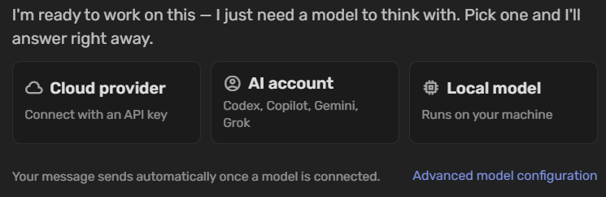
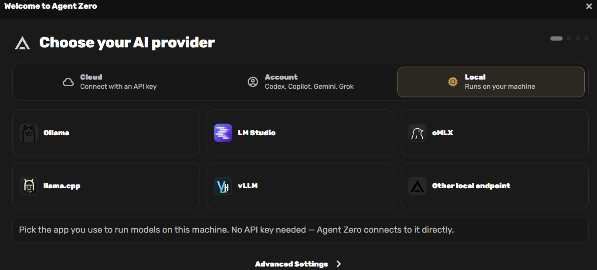
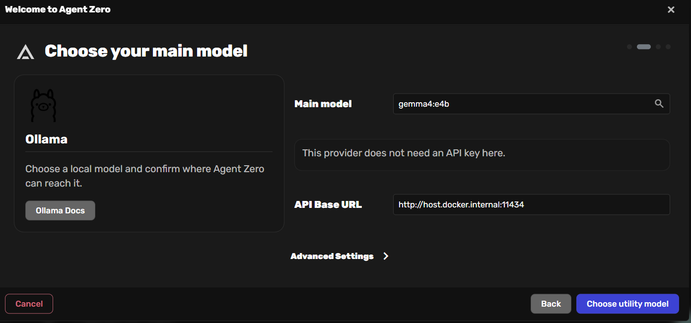
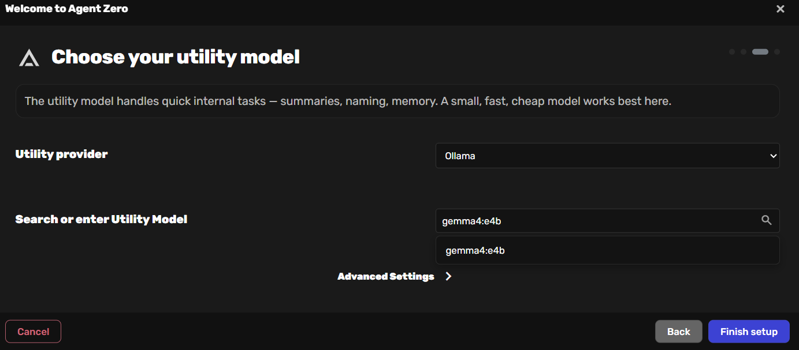
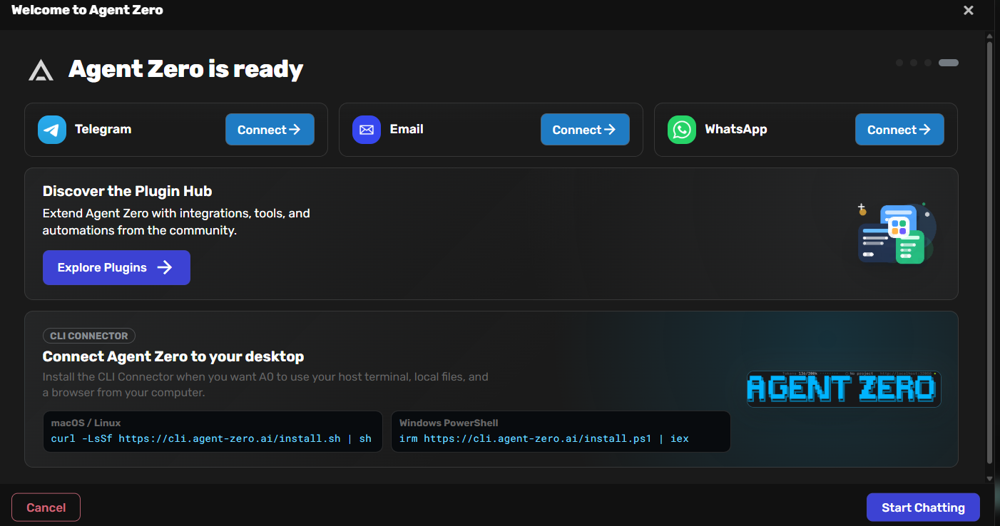

# Agent Zero + Ollama — Advanced Docker Compose Setup (2026)

**Run a powerful, fully local AI Agent for FREE with GPU acceleration, auto-updates, and management UI.**

This repository provides a production-ready Docker Compose setup for **Agent Zero** (agentic AI framework) + **Ollama** (local LLMs).

## ✨ Features

- **Fully local & private** — No API keys or cloud costs
- **GPU accelerated** (NVIDIA) for fast inference
- **Watchtower** — Automatic container updates
- **Portainer** — Web UI to manage all containers
- **Persistent volumes** for models and agent data
- **Healthchecks** and smart dependency ordering
- **15 detailed tutorials** with step-by-step guiding recipes
- Easy one-command deployment with port conflict resolution

## 📋 Prerequisites

- Docker + Docker Compose v2+
- **NVIDIA GPU + NVIDIA Container Toolkit** (optional; this profile targets CPU-only)
- This compose profile is tuned for **64GB RAM / 16 cores under WSL2** — see the
  "WSL2 hardware notes" comment at the top of `docker-compose.yml` and adjust
  `.env` if your machine differs
- 50+ GB free disk space
- Linux, macOS, or Windows (WSL2)

## 🚀 Quick Start

```bash
# 1. Clone the repository
git clone https://github.com/oattia-ot/agentzero-ollama-setup.git
cd agentzero-ollama-setup

# 2. (Optional) Customize
cp -f .env.example .env

# 3. Make setup.sh executable (if needed)
chmod +x setup.sh

# 4. Start all services (automatically frees conflicting ports)
./setup.sh -f docker-compose.yml up -d
```

### 4. Pull the Models

```bash
# Main model - Choose ONE:

# Recommended - Fast & efficient (best for most users - recommended context length: 65536)
docker compose exec ollama ollama pull qwen2.5:7b
# Alternative - Higher quality but slower
# (Only recommended if you have a strong GPU - recommended context length: 198000)
# docker compose exec ollama ollama pull glm-4.7-flash


# Embedding model - Choose ONE:

# Recommended (best balance - recommended context length: 8192)
docker compose exec ollama ollama pull nomic-embed-text
# Alternative - Higher quality (medium size - recommended context length: default -> 512, Best choice -> 8192)
# docker compose exec ollama ollama pull snowflake-arctic-embed

# List all pulled Ollama models
docker compose exec ollama ollama list
```

### 5. Restart Agent Zero

```bash
docker compose restart agent-zero
```

### 6. Access the Interfaces

- **Agent Zero UI**: [http://localhost:8080](http://localhost:8080)
- **Portainer**: [http://localhost:9000](http://localhost:9000)

## 🖥️ Portainer Initial Setup (First Time)

Portainer is a popular open-source web-based management UI for Docker (and Kubernetes).

1. Open **[http://localhost:9000](http://localhost:9000)** in your browser.

2. **Retrieve the setup token** (required for first-time admin creation):
   ```bash
   docker logs portainer 2>&1 | grep 'setup_token='
   ```
   Copy the long token value shown.

3. On the Portainer login screen:
   - Paste the **setup token** into the designated field.
   - Create your **admin account**:
     - **Username**: `admin` (recommended)
     - **Password**: `OpenText2026!` (or choose your own strong password)

4. Click **Create user**.

5. After login, Portainer will automatically detect your local Docker environment.

6. If prompted, select **Docker** → **Socket** and connect using the default path: `/var/run/docker.sock`.

7. You can now visually manage all your containers (`agent-zero`, `ollama`, `watchtower`, etc.).

**Tip**: Save your admin password securely. You won’t need the setup token again after the initial setup.

---

### First-time Configuration in Agent Zero

1. Open **http://localhost:8080**
2. Go to **Settings → Configure Models**
3. Set the following:

   **Main Model**
   - Provider: `Ollama`
   - Model: `qwen2.5:7b`
   - Supports Vision: `Disabled`
   - Context window size: `65536`
   - Expand **> Advanced Settings**
     - API Base URL: `http://ollama:11434`

   **Utility Model**
   - Provider: `Ollama`
   - Model: `qwen2.5:7b`
   - Context window size: `65536`
   - Expand **> Advanced Settings**
     - API Base URL: `http://ollama:11434`

   **Embedding Model** (Recommended)
   - Provider: `Ollama`
   - Model: `nomic-embed-text`
   - Expand **> Advanced Settings**
     - API Base URL: `http://ollama:11434`
   
4. Click **Save** and test with a simple message.

> **Tip**: If you prefer higher quality embeddings, use `snowflake-arctic-embed` instead.

## 🛠️ Advanced docker-compose.yml Features

The included `docker-compose.yml` supports:

- NVIDIA GPU passthrough for Ollama
- Watchtower for automatic updates (label-based)
- Portainer for container management
- Persistent volumes + healthchecks
- Easy environment variable customization

The repository includes a powerful **`setup.sh`** script that:

- Scans for published host ports in your compose files
- Checks whether ports are in use (by Docker containers or OS processes)
- Automatically stops/kills conflicting containers or processes
- Runs any `docker compose` command for you
- After successful `up`, prints ready-to-use URLs (including WSL2 host IP)

**Common usage examples:**

```bash
# Start everything (frees ports first)
./setup.sh -f docker-compose.yml up -d

# Stop everything AND remove all volumes
./setup.sh -f docker-compose.yml down -v

# Other useful commands
./setup.sh up -d
./setup.sh -y up -d          # auto-confirm (non-interactive)
./setup.sh -f docker-compose.yml -f other.yml down -v
./setup.sh -n restart        # dry-run mode
./setup.sh                   # just check ports (no action)
```

Manual update command (without setup.sh):
```bash
docker compose pull && docker compose up -d
```

## Step-by-Step First Time Setup

### Step 1: Choose "Local model"

When you first launch Agent Zero you will see this screen:

**"I'm ready to work on this — I just need a model to think with. Pick one and I'll answer right away."**

Click the **Local model** card (third option).



---

### Step 2: Select Ollama as Provider

You will now see the **"Choose your AI provider"** screen.

1. Click the **Local** tab (it becomes highlighted)
2. Select **Ollama**



---

### Step 3: Configure Your Main Model

This is your main reasoning/chat model.

**Settings:**
- **Main model**: `gemma4:e4b` (great quality/speed balance on 16 cores; `qwen2.5:14b` or `glm-4.7-flash` if you want more headroom traded for speed)
- **API Base URL**: `http://ollama:11434`

> ⚠️ Use `http://ollama:11434` (the Ollama **service name** from docker-compose.yml), not `http://host.docker.internal`.

Click **Choose utility model** (bottom right).



---

### Step 4: Configure Utility Model + Finish

The utility model handles quick internal tasks.

For best performance on a CPU laptop, use the **same model**:

- **Utility provider**: `Ollama`
- **Utility model**: `gemma4:e4b` (or `gemma4:e2b`)

Click **Finish setup**.



---

### Step 5: Agent Zero is Ready – Start Chatting

After clicking **Finish setup**, click the big blue **"Start Chatting"** button.



---

## You're All Set!

Agent Zero is now fully connected to your local Gemma model running in Ollama.

### Quick Recommendations for CPU Laptops

| Use Case                    | Recommended Model     | Why |
|----------------------------|-----------------------|-----|
| Best overall on laptop     | `gemma4:e2b`          | Great speed + quality + tool calling |
| Maximum speed              | `gemma2:2b`           | Very fast, low RAM usage |
| Better quality (if you have 16GB+ RAM) | `gemma4:e4b`     | Higher quality |

---

## 📚 Tutorials

For **15 detailed tutorials** with step-by-step interaction recipes, pro tips, and expected outcomes, see:

→ **[docs/tutorials.md](docs/tutorials.md)**

## 🔧 Useful Commands

```bash
# View logs
docker compose logs -f agent-zero

# Restart Agent Zero
docker compose restart agent-zero

# Pull a new model
docker compose exec ollama ollama pull qwen2.5:14b

# Full reset using setup.sh
./setup.sh -f docker-compose.yml down -v
```

## 🛡️ Security & Best Practices

- Do not expose ports `11434` or `8080` directly to the internet.
- Use strong passwords in Portainer.
- Keep Watchtower scoped to your labeled services.
- Regularly clean up images: `docker image prune -a`

## 📁 Repository Structure

```
agent-zero-ollama-docker/
├── README.md
├── setup.sh
├── docker-compose.yml
├── .env.example
├── docs/
│   ├── setup.md
│   ├── tutorials.md
│   └── troubleshooting.md
├── scripts/
│   ├── pull-models.sh
│   └── backup.sh
├── examples/prompts/
└── .gitignore
```

## 🤝 Contributing

Pull requests are welcome! Especially for:
- New tutorials
- AMD / Apple Silicon support
- Traefik or reverse proxy integration

## 📜 License

MIT License

---

**Made for the local AI community.**  
Run powerful agents without paying API fees.

Enjoy building with Agent Zero + Ollama! 🚀
